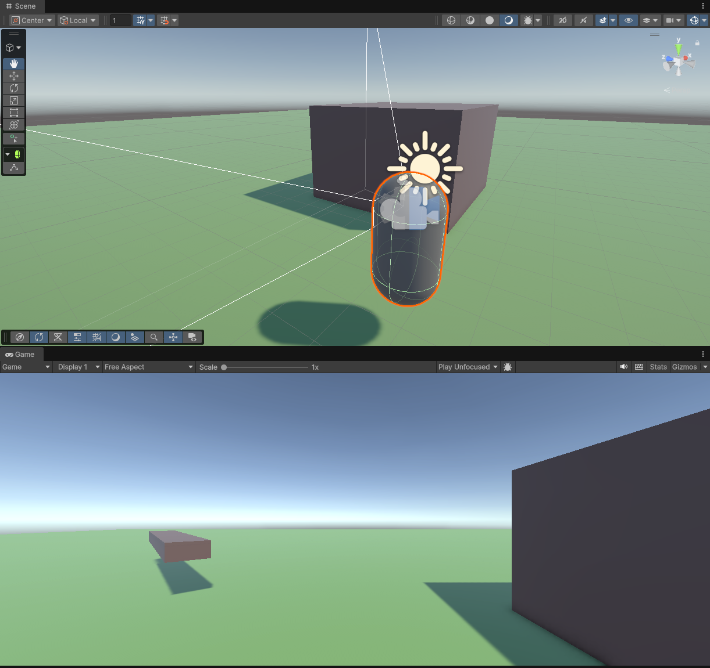
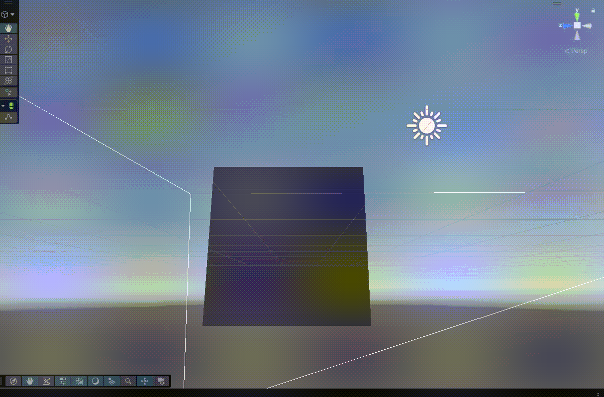

# FPS Controller
A simple, physics-based, fps controller built for Unity 6.3 LTS. 

> [!NOTE]
> This repository is under construction. I reserve the right to change things as time goes on.

## Features
- Physics-based movement using Rigidbody
- Coyote time jump system
- Air Control Multiplier
- Camera-aligned movement
- Configurable movement forces
- Layer-based ground detection
- Wall running, Sliding & Sprinting
- Simple Debug Visuals togglable in the inspector

## Technical Highlights
- Uses ```ForceMode.VelocityChange``` for tight FPS responsiveness
- Separates input polling from physics calculations
- Implements buffered jumping logic (Variable Ground Check during Raycasting)
- Uses raycast-based ground detection with layer masking
- Separated into different systems for modularity
- Uses native Unity Packages (Cinemachine & New Input System!)

## Controls

|Action|Input|
|---|---|
|Move|WASD|
|Jump|Space|
|Look|Mouse|

## Preview
A general overview of the sample scene in the project.


Wall running in action.


## Design Decisions
ForceMode.VelocityChange was chosen because it results in very snappy movement whilst the player is able to interact with other physics objects in the scene seamlessly. 

Ground checks are performed with raycasts as they are performant and allow a jump buffer to be implemented by adjusting the range at which the ray is cast.

A Rigidbody-based controller was chosen over Unity's CharacterController to provide greater flexibility for advanced movement mechanics such as wall running and future movement extensions.

## What I've learned
- Using Cinemachine for Camera modifications
- Designing responsive movement systems with Rigidbody Physics
- Raycasting inside of the Unity Engine

## Development Plan
- [x] Sprinting System 
- [x] Crouch & Slide mechanics
- [x] Surface-based movement
- [x] Wall running
- [x] Jump buffering (Variable Ground Check Raycast)
- [ ] General QoL improvements & fixes (e.g systems separation)

## Installation
To install the project you simply clone the repository or press Code > Download ZIP & then extract the ZIP file. No installation media or executable is provided. Specific Unity version used is Unity 6000.3.13f1, but any Unity 6.3 LTS version should work without any major issues.

## License
This project is licensed under the MIT License - see the [LICENSE](LICENSE) file for details.
